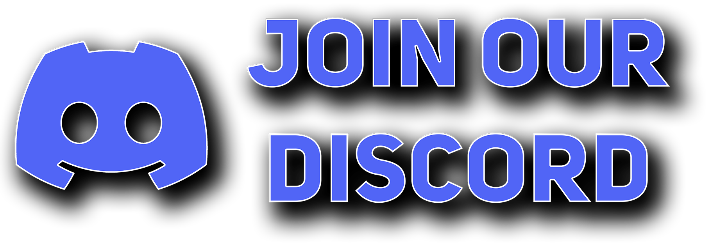

<!-- Shields -->

[![Stargazers][stars-shield]][stars-url]
[![gotoweb][gotoweb-shield]][gotoweb-url]
[![KoFi][kofi-shield]][kofi-url]
[![Tweet][tweet-shield]][tweet-url]
[![Discord][discord-shield]][discord-url]

<!-- PROJECT LOGO -->
 

  

  <h3 align="center">UwUntu OS official Github</h3>

  

    <a href="https://uwuntuos.site">Download UwUntu</a>
    ·
    <a href="https://bugs.launchpad.net/uwuntu">Report Bug</a>
    ·
    <a href="https://answers.launchpad.net/uwuntu">Ask something</a>
  

 
 
<!-- TABLE OF CONTENTS -->

  
Table of Contents

  <ol>
    <li><a href="#about-the-project">About The Project</a></li>
    <li><a href="#ThingsToDo-file">ThingsToDo file</a></li>
    <li><a href="#background-files">Background Files</a></li>
    <li><a href="#Dconf-configuration-and-Desktop-layout">Dconf configuration and Desktop layout</a></li>
    <li><a href="#Plymouth">Plymouth</a></li>
    <li><a href="#Skel-files">Skel files</a></li>
     <li><a href="#Ubiquity">Ubiquity</a></li>
    <li><a href="#uwuntu-repositories">UwUntu Repositories</a></li>
    <li><a href="#community">Community</a></li>
    <li><a href="#help-the-project">Help The Project</a></li>
  </ol>

 
 

<!-- ABOUT THE PROJECT -->
## About The Project

UwUntu is a distro of Ubuntu, meaning its easy enough for new users to go into it, but we gave it the customization we thought it needed to become an OS that we, at the UwUntu team, would use on our daily life.

 
 

<!-- ThingsToDo file -->
## ThingsToDo file

The `ThingsToDo` file contains small tasks to do. It contains the apt packages added to UwUntu, Flatpak configuration and some files to edit.
 
 

<!-- Background Files -->
## Background Files
`budgie-jammy-wallpapers.xml` & `budgie-wallpapers.xml`contains the name and location for each background available in UwUntu.

You can get the backgrounds from the UwUntu-ART GitHub.
 
 

<!-- Dconf Configuration & Desktop layout -->
## Dconf configuration and Desktop layout
Contains all the dconf configuration dumped into `uwuntu-settings`, all the themes and icons required and a readme file with the guidelines to apply the dconf settings.
 
 

<!-- Plymouth -->
## Plymouth
Just two images to replace in /usr/share/plymouth

 
 

<!-- Skel -->
## Skel files
All the files required for new users (neofetch, shell, uwuntu-welcome...).
 
 

<!-- Ubiquity -->
## Ubiquity
Just a image to replace in /usr/share/ubiquity/pixmaps/ubuntu
 
 

<!-- UwUntu Repositories -->
## UwUntu Repositories

[![UwUntu-Art][github-art]][UwUntu-Art-url]
[![KoFi][github-artpsd]][UwUntu-Art-PSD-url]
[![Aisleriot-Cards][github-aisleriot]][Aisleriot-Cards-url]
[![UwUntu-info-updater][github-infoupdater]][UwUntu-info-updater-url]
[![UwUntu-plymouth-theme][github-plymouth]][UwUntu-plymouth-theme-url]
[![UwUntu-ubiquity-slideshow][github-slideshow]][UwUntu-ubiquity-slideshow-url]
[![UwUntu-welcome][github-welcome]][UwUntu-welcome-url]
 
 

<!-- Community -->
## Community

To get support for UwUntu specific issues, the UwUntu Discord is the best place to go. You can raise issues and help other members of our growing community.

 

  

 
 

<!-- Help The Project -->
## Help The Project

This whole project has been done by two students who wanted to have fun with something different related to what we were studying.

In this process we fell in love with Linux and now we are planning to take this as a serious project, adding even more customization and support to other graphical environments.

If you’d like to contribute to this project, knowledge about Linux is always welcome, and if you would like to support us even more a donation will always be appreciated.

 

  

(<a href="#readme-top">back to top</a>)

<!-- SHORTCUTS -->

<!-- SHIELDS LINKS -->
<!--GITHUB STARS-->
[stars-shield]: https://img.shields.io/github/stars/Duxi4/UwUntu?style=for-the-badge&logo=Linux&logoColor=C689C6&color=FFABE1
[stars-url]: https://github.com/Duxi4/UwUntu/stargazers

<!--UWUNTUOS.SITE-->
[gotoweb-shield]: https://img.shields.io/badge/UwUntu%20Website-hi?style=for-the-badge&logo=Internet%20Explorer&logoColor=C689C6&color=FFABE1
[gotoweb-url]: https://uwuntuos.site

<!--KO-FI-->
[kofi-shield]: https://img.shields.io/badge/Buy%20us%20a%20cofee-KoFi?style=for-the-badge&logo=KoFi&logoColor=C689C6&color=FFABE1
[kofi-url]: https://ko-fi.com/uwuntu

<!-- Tweet about us-->
[tweet-shield]: https://img.shields.io/badge/Tweet%20about%20us-hi?style=for-the-badge&logo=Twitter&logoColor=C689C6&color=FFABE1
[tweet-url]: https://bit.ly/380p4nL

<!--Discord server -->
[discord-shield]:https://img.shields.io/badge/Join%20our%20discord-hi?style=for-the-badge&logo=Discord&logoColor=C689C6&color=FFABE1
[discord-url]:https://discord.gg/US38bG9n8c

<!-- Other Repos -->
[github-art]:https://img.shields.io/badge/REPO:-UwUntu%20Art-hi?style=for-the-badge&logo=GitHub&logoColor=C689C6&color=FFABE1
[UwUntu-Art-url]:https://github.com/Duxi4/UwUntu-Art

[github-artpsd]:https://img.shields.io/badge/REPO:-UwUntu%20Art%20PSD-hi?style=for-the-badge&logo=GitHub&logoColor=C689C6&color=FFABE1
[UwUntu-Art-PSD-url]:https://github.com/Duxi4/UwUntu-Art-PSD

[github-aisleriot]:https://img.shields.io/badge/REPO:-UwUntu%20Aisleriot%20Cards-hi?style=for-the-badge&logo=GitHub&logoColor=C689C6&color=FFABE1
[Aisleriot-Cards-url]:https://github.com/Duxi4/UwUntu-Aisleriot-Cards

[github-infoupdater]:https://img.shields.io/badge/REPO:-UwUntu%20info%20updater-hi?style=for-the-badge&logo=GitHub&logoColor=C689C6&color=FFABE1
[UwUntu-info-updater-url]:https://github.com/Duxi4/UwUntu-info-updater

[github-plymouth]:https://img.shields.io/badge/REPO:-UwUntu%20plymouth%20theme-hi?style=for-the-badge&logo=GitHub&logoColor=C689C6&color=FFABE1
[UwUntu-plymouth-theme-url]:https://github.com/Duxi4/UwUntu-plymouth-theme

[github-slideshow]:https://img.shields.io/badge/REPO:-UwUntu%20ubiquity%20slideshow-hi?style=for-the-badge&logo=GitHub&logoColor=C689C6&color=FFABE1
[UwUntu-ubiquity-slideshow-url]:https://github.com/Duxi4/UwUntu-ubiquity-slideshow

[github-welcome]:https://img.shields.io/badge/REPO:-UwUntu%20welcome-hi?style=for-the-badge&logo=GitHub&logoColor=C689C6&color=FFABE1
[UwUntu-welcome-url]:https://github.com/Duxi4/uwuntu-welcome